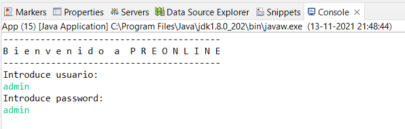
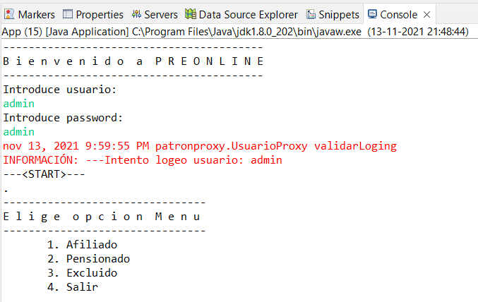
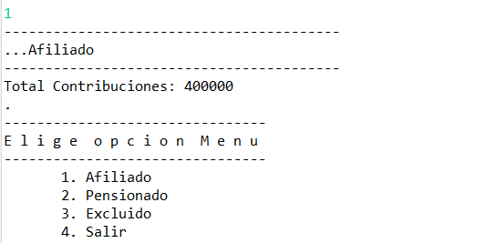
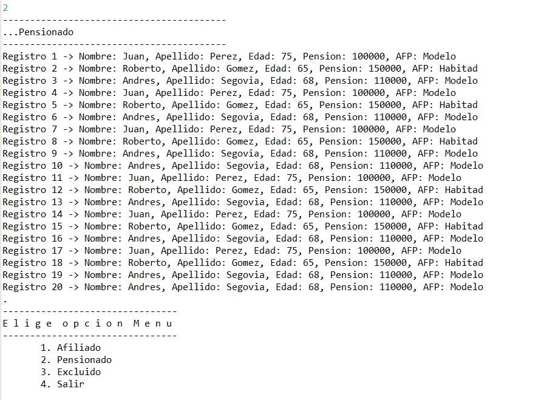
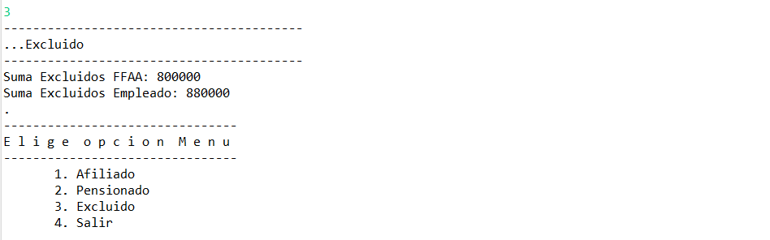

# Examen - Patrones de Diseño

_Se realiza un sistema de gestión que consume 3 APIs con datos de otros sistemas_

## Comenzando 🚀

_Estas instrucciones te permitirán obtener una copia del proyecto en funcionamiento en tu máquina local para propósitos de desarrollo y pruebas._


### Pre-requisitos 📋

```
- npm/Node para levantar json-server
- JDK 1.8 para levantar el proyecto principal en Java
```

### Instalación 🔧

_A continuación instalación de Json-Server_

_Paso 1: Luego de instalado Node ejecutar comando:_

```
npm install -g json-server
```

_Paso 2: Navegar hasta donde se encuentra db.json:_

```
cd data
```

_Paso 3: Levantar servicio, verificar que se encuentra libre el puerto 3000_

```
json-server --watch db.json
```

_Una vez realizado lo anterior se puede ejecutar el proyecto desde Eclipse(preferentemente)_

## Ejecutando las pruebas ⚙️


### Login 🔩

```
Ingreso usuario / password
```


```
Login correcto
```


### Navegar menú ⌨️

```
Menú inicial
```


### Elección opción ⌨️

```
Menú opción 1
```


```
Menú opción 2
```


```
Menú opción 3
```


```
Menú opción 4
```


## Construido con 🛠️

_Menciona las herramientas que utilizaste para crear tu proyecto_

* [JAX-RS 2.1](https://repo1.maven.org/maven2/org/glassfish/jersey/bundles/jaxrs-ri/2.35/jaxrs-ri-2.35.zip) - Eclipse Jersey is a REST framework
* [json-server](https://github.com/typicode/json-server) - Get a full fake REST API with zero coding in less than 30 seconds (seriously)

## Autor ✒️

* **Jorge Bustamante Valdés** - *Todas las tareas* - https://github.com/jbvaldes/Patrones/tree/44290a4a0804837218186e5e408e5ad8ca0d3ee0/examen_final
  
* 
